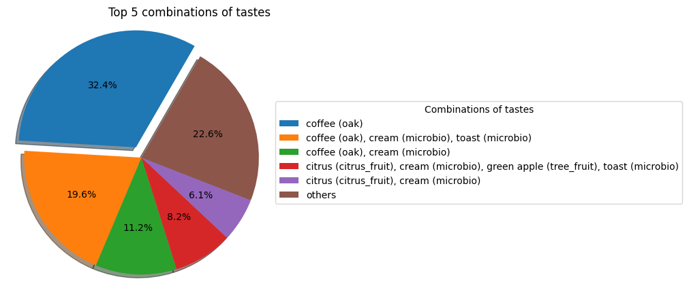

# Vivinio Project

This group project is a part of **AI Bootcamp** at [<\/becode>](https://becode.org/)

 
## Description

### Mission Objectives

A learning challenge, **Wiwinio Project** targetted to acquire and consolidate knowledge in the following subjects:

- SQL and Databases
- Data Analysis
- Data Analysis deployment using [Tableau](https://www.tableau.com) and/or [Streamlit](https://streamlit.io/)


### Data

A sample database ([SQLite](https://www.sqlite.org/index.html)), reflecting the assortiment, ratings, and sales information for the Belgian market, from the wine selling website ([Vivino](https://www.vivino.com/BE/en/)) was provided.

#### Database structure


### Questions to be answered

The team had to answer several questions, like...

1. Highlight 10 wines to increase the sales. Which ones should be choosen and why?
2. With the marketing budget for this year, which country should be prioritzed and why?
3. Analyse the special tastes and their combinations.
4. Select top 5 wines produced from the most popular grapes.
5. Create a country leaderboard based on the wines ratings and popularity.


## Analysis

The analysis is done and saved in Jypiter Notebooks.

Here are some plots to illustrate some findings:

### Top wines by Country


### Grape popularity


### Special tastes distribution


### Combinations of tastes: Top frequent Combo




## Deliverables

The results are delivered as a [Streamlit](https://streamlit.io/)-based web app.

Please see *Usage* instructions below.


## Installation

The **Wiwinio Project** is available from the [GitHub repository](https://github.com/danielbauwens/Wiwinio-Project). PLease, follow the following instructions to clone and browse the project files.

- Clone the [project repository](https://github.com/danielbauwens/Wiwinio-Project.git) to your local machine
- Navigate to clone's root folder
- Create and activate project's *virtual environment*
    - Run: `python -m venv _project_env`
    - Run: `source _project_env/Scripts/activate`
- Install the required libraries:
    - [](https://python.org)
    - [](https://pandas.pydata.org/)
    - [](https://numpy.org/)
    - [](https://matplotlib.org/)
    - [](https://seaborn.pydata.org/)
    - [](https://plotly.com/)
    - [](https://pypi.org/project/ipykernel/)
    - [](https://www.sqlalchemy.org/)
    - [](https://streamlit.io/)

    You can click on the badge links to learn more about each library and its specific version used in this project.
    You can install them manually using `pip install <library name>` or just running `pip install -r requirements.txt`.


### Usage

- To use Streamlit-based presentation do as follows:
    - Run `cd src` to move to *src* folder
    - Run `streamlit run 1_??_Home.py` to open the web app
    - Explore the analysis


## Repository folder structure

The project folder is organized as follows:

```
.
└── Repository Name/
    ├── data/
    │   └── < data files (e.g. db, csv, pickles, etc.) >
    ├── src/
    │   └── pages/
    │   │   └── < streamlit pages > 
    │   └── 1_🌐_Home.py
    ├── notebooks/
    │   └── < notebooks for data exploration >
    ├── output/
    │   └── < any artifacts of analysis (graphs, model objects, etc.) >
    ├── .gitattributes
    ├── .gitignore
    ├── requirements.txt
    ├── main.py
    └── README.md

```

## Contributors

**Fatemeh Loni** (Team Lead & Data Analyst) [LinkedIn](https://www.linkedin.com/in/fatemeh-loni-3b4960226/) | [GitHub](https://github.com/Finol12)


**Daniel Bauwens** (Data Engineer) [LinkedIn](https://www.linkedin.com/in/daniel-bauwens-5515a8256/) | [GitHub](https://github.com/danielbauwens)


**Vitaly Shalem** (Data Analyst) [LinkedIn](https://www.linkedin.com/in/vitaly-shalem-26aab265/) | [GitHub](https://github.com/vitaly-shalem)


## Place and Time

[BeCode.org](https://becode.org/) (Ghent, Belgium)

August 2023
